# YandexMarket-analysis — Парсинг Yandex Market и анализ рынка автомобильных фильтров

## О проекте
Проект посвящён сбору и анализу данных с Yandex Market о товарах в категории "автомобильные фильтры". Основная цель — исследовать рыночные тренды, цены, популярность брендов и построить интерактивный дашборд в Power BI. Проект включает полный цикл: от парсинга до визуализации.

## Возможности
- **Парсинг данных с Yandex Market** — сбор информации о товарах (цена, рейтинг, количество покупок, бренд) с пагинацией
- **Очистка и анализ данных** — удаление выбросов, расчёт средних, группировка по брендам
- **Анализ брендов** — выявление лидеров по цене, популярности и рейтингу
- **Корреляционный анализ** — исследование связи между ценой, рейтингом и количеством покупок
- **Интерактивный дашборд в Power BI** — визуализация KPI, таблиц и графиков

## Работа с данными
- **Источник данных** — Yandex Market (реальные данные о товарах в категории "автомобильные фильтры")
- **Обработка в Python (pandas)**:
  - Предварительный просмотр и очистка данных (удаление выбросов < 100р.)
  - Расчёт базовых метрик (средняя цена, рейтинг, количество покупок)
  - Группировка и агрегация по брендам
  - Корреляционный анализ
- **Визуализация в Python (matplotlib)** — дополнительные графики для предварительного анализа
- **Итоговая визуализация в Power BI** — построение интерактивного дашборда с KPI, таблицами и фильтрами

## Аналитические способности
- Анализ 30+ брендов по цене, рейтингу и популярности
- Выявление лидеров рынка по количеству покупок
- Корреляционный анализ:
  - цена/рейтинг — почти нет связи (0.01)
  - цена/покупки — слабая отрицательная (-0.1)
  - рейтинг/покупки — почти нет связи (0.01)
- Сравнение брендов по средним показателям

## Ключевые выводы 
- **Средняя цена:** 426 ₽ (включая "Бренд не указан")
- **Средний рейтинг:** 4.7 / 5.0
- **Среднее количество покупок:** 89
- **Топ-3 бренда по покупкам:** GENERAL MOTORS, Hyundai/KIA, Double Force
- **Корреляция цена/покупки:** практически отсутствует (-0.1)

## Технологии
- **Python** 3.11+
- **requests** — для HTTP-запросов
- **BeautifulSoup4** — для парсинга HTML
- **fake_useragent** — для имитации браузера
- **pandas** >= 2.0.0 — для обработки данных
- **matplotlib** >= 3.5.0 — для визуализации
- **Power BI** Desktop — для дашборда

## Технические детали
### Парсинг использует:
- **Пагинацию** — сбор данных со всех страниц (до 100)
- **Регулярные выражения** — извлечение чистых чисел из текста
- **Асинхронные задержки** — имитация человеческого поведения

### Визуализация использует:
- **Power BI Desktop** — основной инструмент для построения дашборда
- **Matplotlib (Python)** — дополнительная визуализация для предварительного анализа

## Результат:
### Основной дашборд
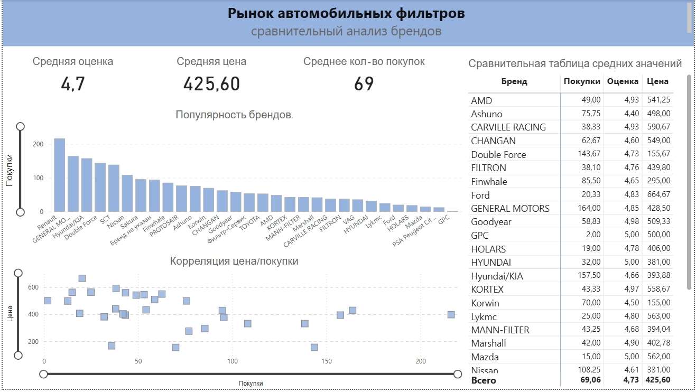

### Предварительный анализ в консоли Python
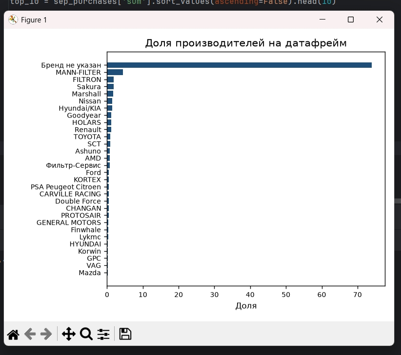
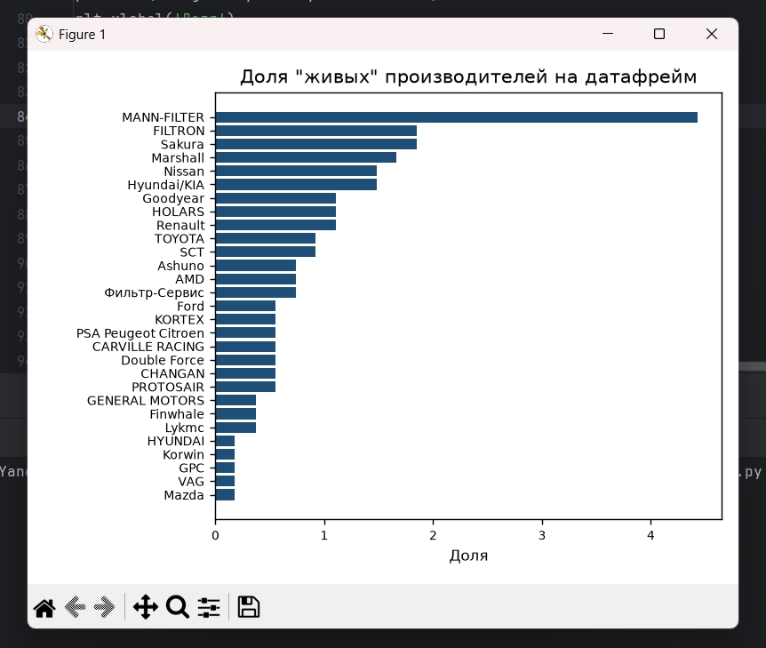
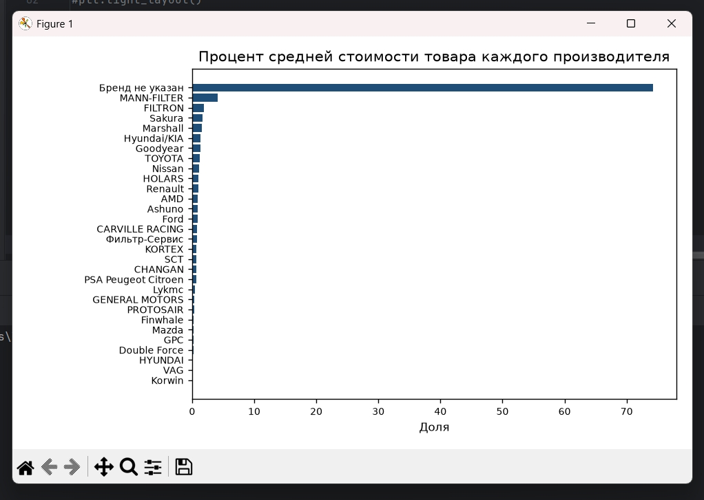
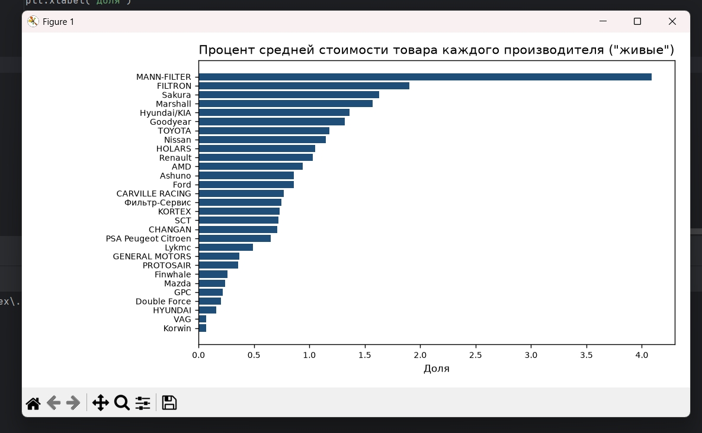
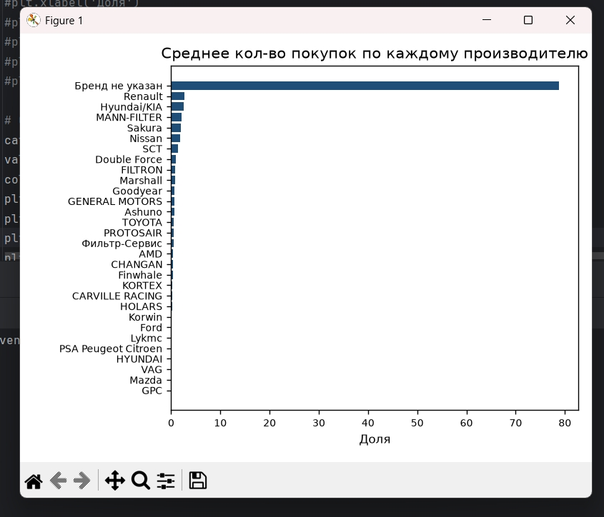
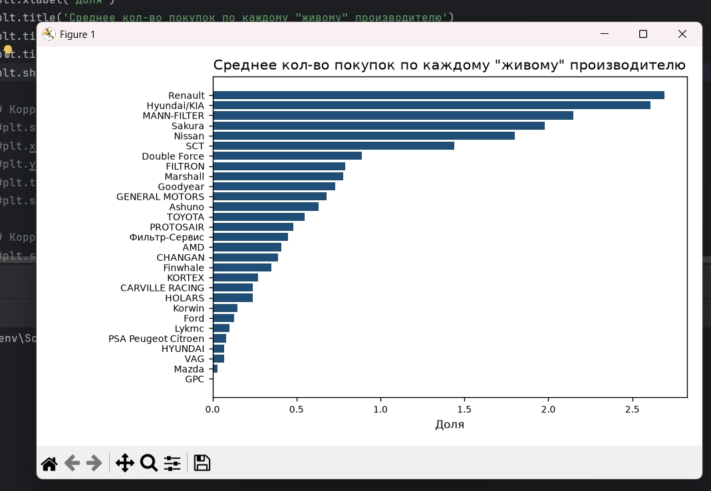
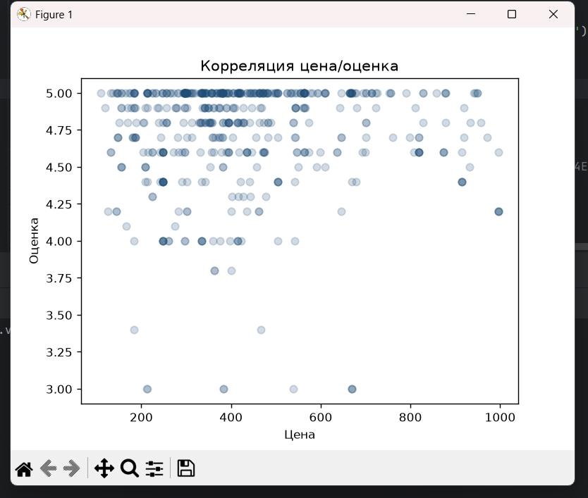
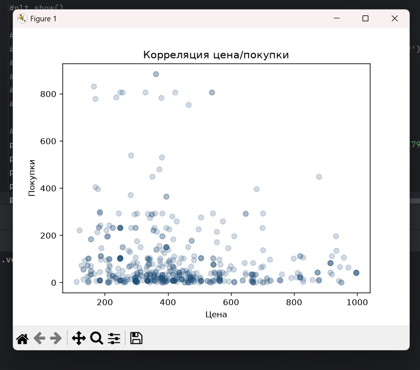
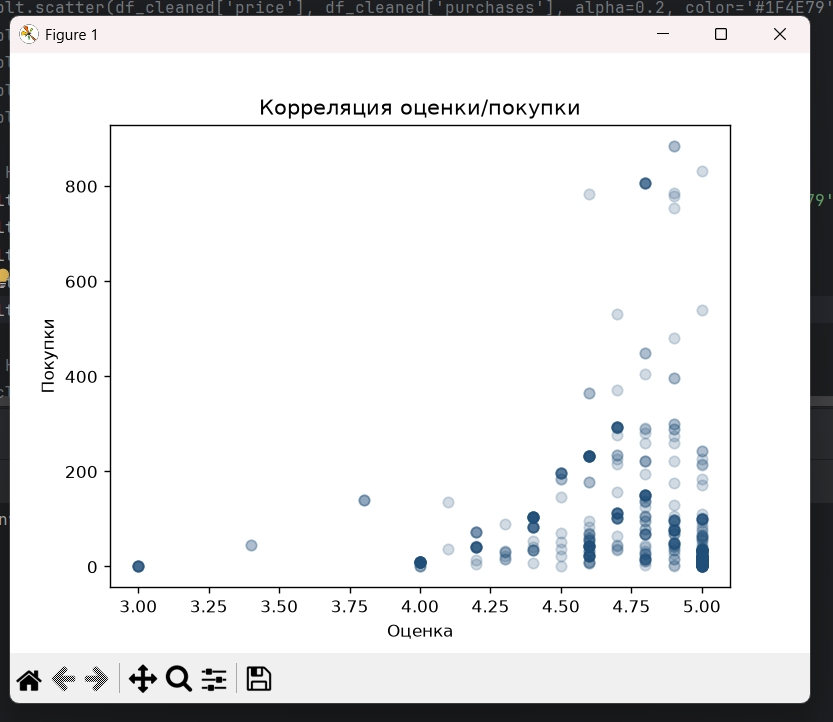
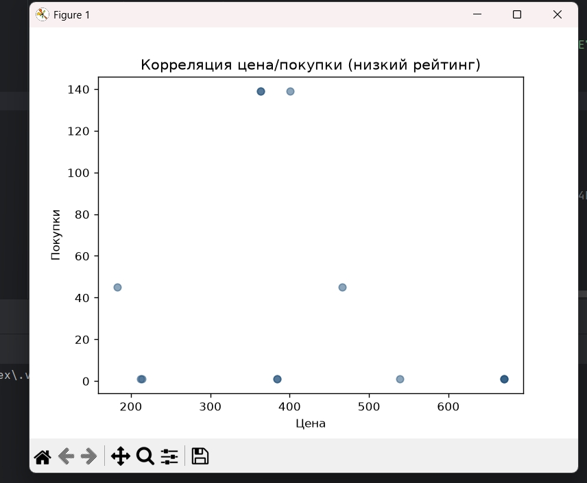
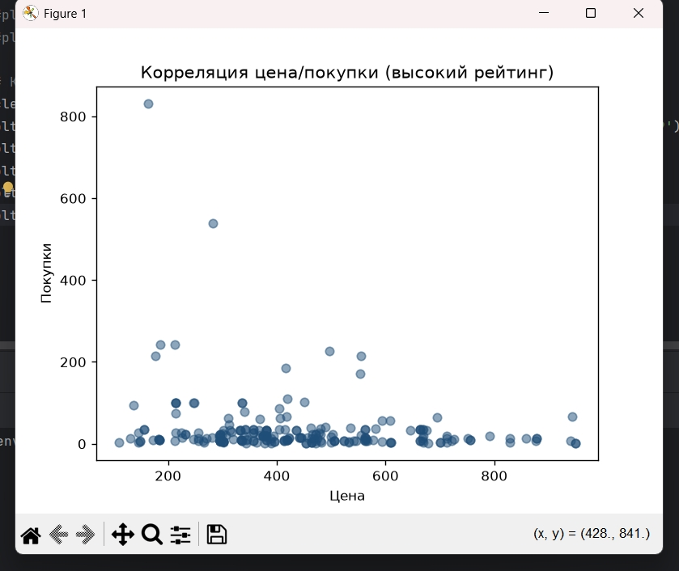

### Выгрузка агрегированных данных
#### Выгрузка карточек товаров
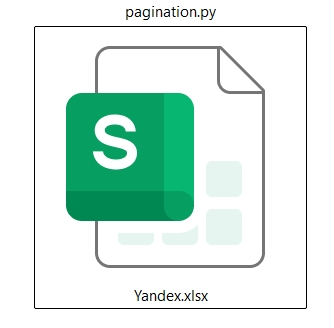
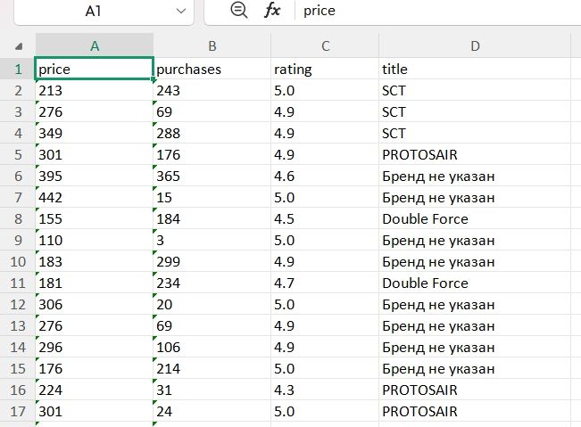

#### Выгрузка агрегированных данных для построения дашборда
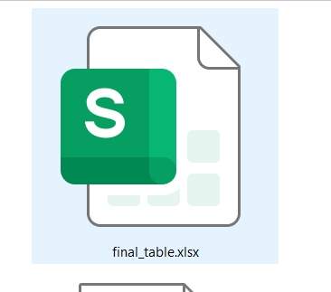
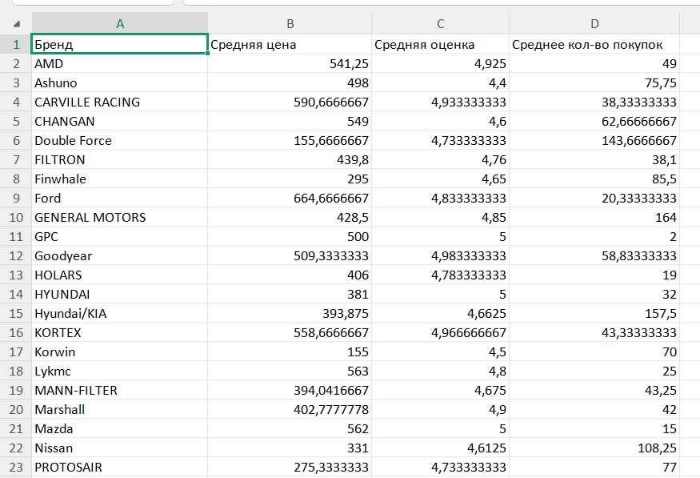


## Установка и запуск

***Клонирование проекта:***
```
git clone https://github.com/Anastasia-0-Iva/YandexMarket-analysis.git
cd YandexMarket-analysis
```

***Создание виртуального окружения:***
```
# Windows
python -m venv venv
.\venv\Scripts\activate

# Linux/macOS
python3 -m venv venv
source venv/bin/activate
```

***Установка зависимостей:***
```
poetry install
```